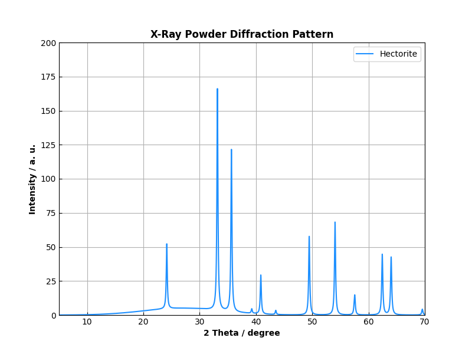

# XrdQty: Synthetic Data Pipeline for Phase Quantification

[](https://choosealicense.com/licenses/mit-license/)
[](https://www.python.org/)

## Overview
**XrdQty** is an end-to-end machine learning pipeline designed for the quantitative analysis of complex pattern signatures (X-ray Diffraction). The project addresses the challenge of **data scarcity** in analysis by implementing a physics-based synthetic data generator to train a deep learning model for multi-target regression.

The system transforms raw physical parameters into high-fidelity synthetic pattern, which are then used to train a **1D-Convolutional Neural Network (CNN)** capable of quantifying the composition of multi-phase mixtures with high precision.



**Figure 1:** Typical X-ray Diffraction Pattern for a crystalline Mineral Phase.

---

## Technical Architecture

### 1. The Data Engine (Physics-Based Synthesis)
Instead of relying on limited experimental datasets, XrdQty implements a generative model based on physical laws:
*   **Signal Synthesis:** Implements the **Cauchy Distribution** to simulate peak shapes and intensities, incorporating the **Scherrer equation** logic for crystallite size and peak broadening (FWHM).
*   **Stochastic Composition:** A random sampling engine that generates diverse mineral phase combinations, ensuring the training set covers a wide variance of the feature space.
*   **Noise Injection:** To increase model robustness and prevent overfitting, the pipeline injects realistic background noise and baseline offsets into the synthetic signals.
*   **Data Normalization:** Integrated `StandardScaler` pipelines to ensure feature scaling for optimal neural network convergence.

### 2. The Deep Learning Model (1D-CNN)
The core of the quantification engine is a custom **1D-Convolutional Neural Network** implemented in **PyTorch**, optimized for sequential spectral data:
*   **Feature Extraction:** Three convolutional layers (`Conv1d`) with increasing filter depth (32 $\rightarrow$ 64 $\rightarrow$ 128) to extract hierarchical spectral patterns (from simple peaks to complex phase overlaps).
*   **Downsampling:** `MaxPool1d` layers to reduce spatial dimensionality and ensure translation invariance of the spectral peaks.
*   **Regression Head:** A fully connected MLP (Multi-Layer Perceptron) that maps the extracted features to a continuous output vector representing the fractional composition of each phase.
*   **Hardware Acceleration:** Native support for **CUDA**, allowing for seamless switching between CPU and GPU for high-speed training.

### 3. Evaluation & Lifecycle
*   **Loss Function:** Optimized using Mean Squared Error (MSE) for regression.
*   **Metrics:** Implementation of **Mean Absolute Error (MAE)** to quantify the deviation between predicted and ground-truth compositions.
*   **Persistence:** Full model serialization/deserialization logic (`.pth` files) for production-ready deployment.

---

## Tech Stack
*   **Deep Learning:** PyTorch (nn.Module, Conv1d, Optim)
*   **Data Science:** NumPy, Pandas, Scikit-Learn (StandardScaler, train_test_split)
*   **Mathematics:** Cauchy Distribution, Spectral Analysis, Signal Processing
*   **Hardware:** CUDA-enabled GPU acceleration

---

## ML Workflow
**Synthetic Generation** $\rightarrow$ **Pre-processing** $\rightarrow$ **CNN Training** $\rightarrow$ **Model Validation** $\rightarrow$ **Inference**

1.  **Generator:** `PDFData` $\rightarrow$ Creates $\sim 10^n$ synthetic samples based on physical structure files.
2.  **Trainer:** `XrdQty.model_training` $\rightarrow$ Fits the 1D-CNN to the synthetic data.
3.  **Quantifier:** `XrdQty.predict` $\rightarrow$ Takes a new, unknown diffraction pattern and outputs the quantitative phase composition.

---

## Installation & Usage
 
```bash
# Clone the repository
git clone https://github.com/markus-schindler/XrdQty.git
cd XrdQty

# Create a virtual environment (optional but recommended)
python -m venv /path/to/new/virtual/environment
source /path/to/new/virtual/environment/bin/activate
  
# Install dependencies
pip install -r requirements.txt
  
# Import the module in python
import XrdQty

# Initiate XrdQty
xrd_qty = XrdQty.XrdQty(start_angle = 10, stop_angle = 90, angle_steps = 8501, model_name = "model_name")

# Create Training Data
xrd_qty.create_training_data()

# CNN Model Training; Model is saved as model_name.pth
xrd_qty.model_training()

# Load existing Model
xrd_qty.load_model()

# Predicting Phase Quantity
xrd_qty.predict("XRD Data.csv")

```
  
## Project Structure
```text                                                 
├── maxIntensity.csv    # Reference peak intensities
├── README.md           # This file
├── requirements.txt    # Dependency list
├── structure/          # XRD pattern files
├── XrdQty.py           # Main execution engine
└── LICENSE             # MIT License
```

## License

This project is licensed under the MIT License - see the LICENSE file for details

© 2026 Markus Schindler
